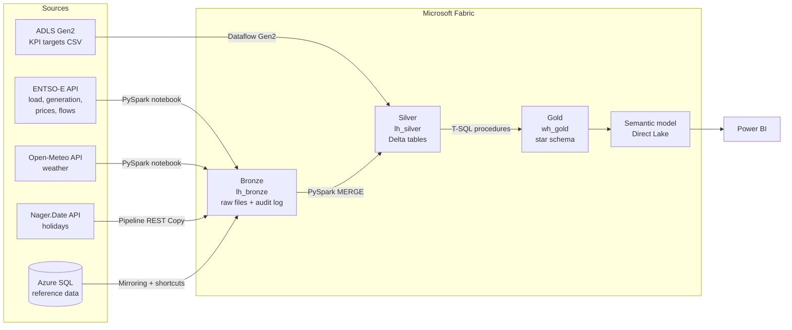

# European Energy & Carbon-Intensity Platform on Microsoft Fabric

An end-to-end data platform that answers one question: **how clean is the electricity in Europe, hour by hour, and when is the greenest time to use it?**

It combines grid data from ENTSO-E, weather from Open-Meteo, public holidays, a reference database in Azure SQL and business KPI targets into a governed medallion architecture on Microsoft Fabric. Every result is traceable from the report back to the raw API file it came from.

> **Status:** data platform complete (Bronze → Silver → Gold, orchestration, security, CI/CD). Reporting and AI layer in progress. See [Roadmap](#roadmap).

---

## Why this project

The project started while volunteering on a sustainable farm, where I met someone running a carbon-offset project. Offsetting only makes sense when you know how much carbon your electricity actually carries, and that depends on the country, the hour and the energy mix. This platform is the data foundation for that kind of carbon insight: reliable, hourly and explainable, including where the source data is incomplete.

## Architecture



| Layer | Item | What it holds |
|---|---|---|
| Bronze | `lh_bronze` | Raw XML / JSON exactly as received, audit log `ctl_ingest_log`, watermarks `ctl_watermark` |
| Silver | `lh_silver` | Cleaned, deduplicated Delta tables at source resolution, data-quality results and quarantine |
| Gold | `wh_gold` | Hourly star schema: 6 facts, 8 dimensions, run log, security objects |
| Serving | `sm_energy_sustainability` | Direct Lake semantic model with DAX measures |

## In numbers

- **~9 million** curated rows, 4 pilot countries (IT, FR, DE, NL), 10 bidding zones, 30 cross-border directions, data since 2024-01-01
- Backfill: **1,584 API chunks, 0 errors**, resumable from the audit log
- Daily end-to-end run: **~27 → ~17 minutes** after optimisation (see below)
- Regression check: NL carbon intensity on 2025-06-15 = **315.7 gCO2e/kWh**, identical in Gold (T-SQL) and in the semantic model (DAX)

## Engineering decisions

**Idempotent at every layer.** Any run can be repeated without creating duplicates.
- *Bronze*: watermark per dataset and area, plus a re-pull window for late corrections. Every file is logged with status, so failed chunks are retried, not lost.
- *Silver*: dedupe by business key (latest ingest wins), then a conditional Delta `MERGE`. A state table tracks the processed point by Bronze ingest time, not by data time.
- *Gold*: transactional delete-insert over a sliding window, with a Silver-vs-Gold reconciliation gate that fails the run on mismatch (`THROW`).

**Honest carbon numbers.** Generation without a known emission factor is not treated as zero-carbon. Carbon intensity is reported together with a *factor coverage %*. This matters for the Netherlands, where ENTSO-E classifies about a third of generation as "Other" and under-reports rooftop solar.

**History where it matters.** Emission factors are an SCD Type 2 dimension, so each hour's CO2e is calculated with the factor that was valid at that time. Changing a factor does not silently rewrite the past.

**Explicit business rules** for tricky source behaviour: DE-LU publishes both 15-minute and hourly prices (official hourly price wins); flows use one resolution per border-hour to avoid double counting; the A03 curve type is forward-filled.

## Performance optimisation

| Change | Effect |
|---|---|
| Batched Open-Meteo requests (all locations per call) | 22 → 2 API calls |
| Incremental daily data-quality checks, full scan weekly, `OPTIMIZE` only above a file threshold | Less daily Spark work |
| Shared Silver helper notebook, broadcast join for small lookups | Less code, fewer shuffles |
| Shared Spark session (high concurrency) across pipeline notebooks | Fewer session start-ups |
| Diagnosed Spark throttling (error 430) and right-sized capacity | Stable runs |

Result: daily pipeline **~27 → ~17 minutes**.

## Orchestration

`pl_master` runs daily at 06:00 Europe/Rome: Bronze ENTSO-E → Bronze weather → monthly branch (holidays, KPI Dataflow) → Silver → Gold. A failure path alerts and ends in a **Fail activity**, so a handled error still marks the run as failed. Activator watches pipeline job events.

## Security & governance

- Workspace roles and least-privilege item sharing
- Warehouse **row-level security** by country, **column-level** `DENY` on a sensitive column, **dynamic data masking** on run-log messages
- OneLake data access roles configured on the lakehouse
- Secrets (ENTSO-E API key) only in **Azure Key Vault**, read at runtime with `notebookutils.credentials.getSecret`, never stored in code
- Least-privilege SQL login for Fabric Mirroring

## CI/CD

- Fabric **Git integration**: the `energy-dev` workspace is synced to `main`, so every item in `fabric/` is versioned source
- **Deployment pipeline** dev → test
- Conventional commits and a [CHANGELOG](CHANGELOG.md)

## Repository structure

```
fabric/                 Fabric items synced by Git integration
  nb_1x_*               Bronze notebooks (ENTSO-E, weather)
  nb_2x_*, nb_lib_*     Silver notebooks, shared helpers, data quality
  pl_*                  Data pipelines
  df_kpi_thresholds     Dataflow Gen2
  wh_gold.Warehouse/    Gold tables, procedures, security (dim, fact, ops, sec)
azure-sql/              Reference database schema and seed data
docs/incidents.md       Real incidents and how they were solved
CHANGELOG.md
```

## Roadmap

**1. Foundation** ✅
- [x] Azure SQL reference database: countries, market areas, interconnectors, generation types with emission factors, weather points
- [x] Least-privilege SQL login for Fabric Mirroring
- [x] Fabric workspaces `energy-dev` and `energy-test`, grouped in the `Energy` domain
- [x] Git integration (`energy-dev` ↔ `main`)
- [x] Lakehouses `lh_bronze` and `lh_silver`, Spark environment with pinned libraries
- [x] Mirrored Azure SQL database exposed in Bronze through OneLake shortcuts
- [x] ENTSO-E API key stored in Azure Key Vault

**2. Bronze: raw ingestion** ✅
- [x] Audit log (`ctl_ingest_log`) and watermarks (`ctl_watermark`)
- [x] ENTSO-E notebook: load, generation, prices (10 bidding zones), cross-border flows (30 directions)
- [x] Backfill from 2024-01-01: 1,584 chunks, 0 errors, resumable
- [x] Open-Meteo weather: reanalysis archive + recent forecast
- [x] Holidays pipeline: Lookup → Filter → ForEach → REST Copy
- [x] Retries with back-off, pipeline-safe notebooks

**3. Silver: clean Delta tables** ✅
- [x] Distributed ENTSO-E XML parser on Spark (A03 forward-fill, generation vs consumption)
- [x] Dedupe + conditional `MERGE`, state table for incremental processing
- [x] Weather guard: observed values never overwritten by forecasts
- [x] Data-quality checks (uniqueness, integrity, ranges, completeness, freshness) and quarantine
- [x] `OPTIMIZE` with V-Order
- [x] KPI targets from ADLS via Dataflow Gen2

**4. Gold: star schema** ✅
- [x] `wh_gold` warehouse: 8 dimensions, 6 hourly facts (load, generation, carbon, price, flow, weather)
- [x] Transactional delete-insert procedures per fact
- [x] `ops.usp_load_gold` with a reconciliation gate and run log
- [x] SCD Type 2 emission factors, CO2e computed with the factor valid at each hour

**5. Orchestration** ✅
- [x] `pl_master`: Bronze → monthly branch → Silver → Gold, daily at 06:00 Europe/Rome
- [x] Failure path with alert and Fail activity
- [x] Activator on pipeline job events

**6. Security & governance** ✅
- [x] Workspace roles and least-privilege sharing
- [x] Row-level security, column-level security, dynamic data masking
- [x] OneLake data access roles configured

**7. CI/CD** ✅
- [x] Deployment pipeline dev → test
- [x] Conventional commits and CHANGELOG

**8. Performance** ✅
- [x] Batched weather API calls (22 → 2)
- [x] Incremental DQ checks, conditional `OPTIMIZE`
- [x] Shared helper notebook, broadcast join, shared Spark session
- [x] Daily run ~27 → ~17 minutes

**9. Real-Time Intelligence demo** ✅
- [x] Eventstream → Eventhouse with KQL window queries

**10. Reporting** 🔄 in progress
- [x] Direct Lake semantic model, star relationships, core DAX measures
- [x] Model validated against Gold (NL 2025-06-15 = 315.7)
- [ ] Power BI report: Overview, Country deep-dive, Greenest-hours heatmap, Market & flows

**11. AI layer** ⏳ next
- [ ] Fabric Data Agent over the semantic model
- [ ] Accuracy evaluation set of test questions

**12. Improvements & release** ⏳ planned
- [ ] Holiday flag and emission-factor surrogate key folded into Gold facts
- [ ] Release v1.0.0

## Tech stack

Microsoft Fabric (Lakehouse, Warehouse, Data Factory pipelines, Dataflow Gen2, Mirroring, Real-Time Intelligence, Power BI Direct Lake) · Azure SQL Database · ADLS Gen2 · Azure Key Vault · PySpark · Delta Lake · T-SQL · DAX · Git

## Data sources & licences

- [ENTSO-E Transparency Platform](https://transparency.entsoe.eu/): electricity load, generation, prices and flows
- [Open-Meteo](https://open-meteo.com/): weather (CC BY 4.0)
- [Nager.Date](https://date.nager.at/): public holidays
- Emission factors: IPCC AR5 lifecycle values

## About

Built by Romina Gharemohammadi, Microsoft Certified: Fabric Data Engineer Associate (DP-700). Developed with AI assistance (Claude); every change was reviewed, tested and validated against the data.

Licence: [MIT](LICENSE)
